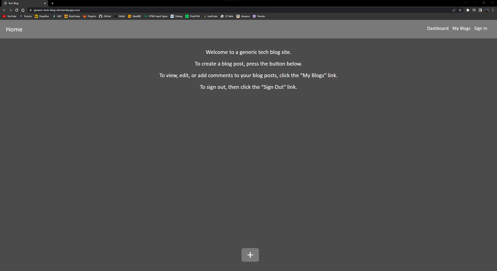
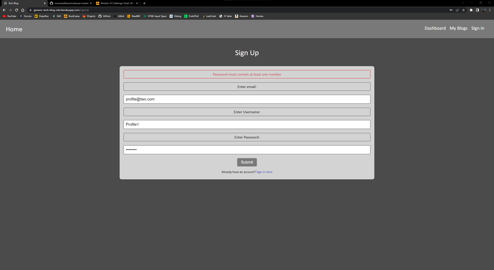
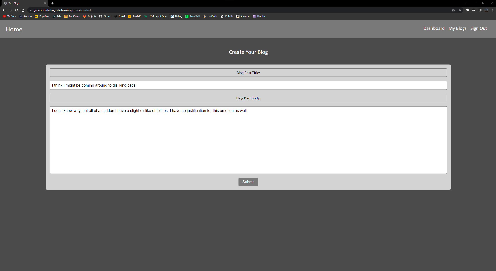
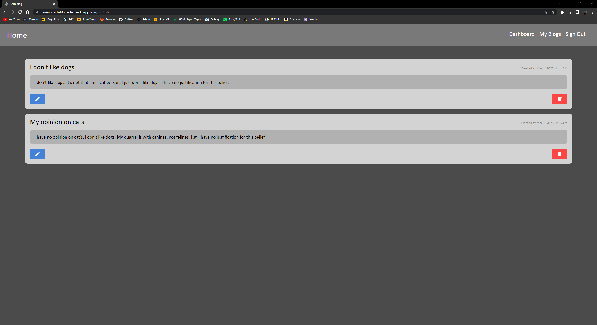
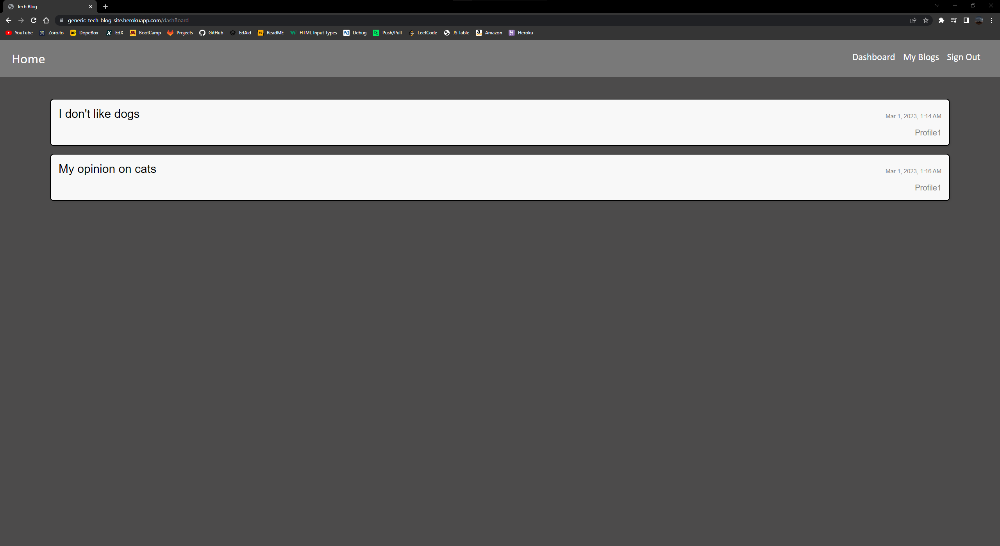
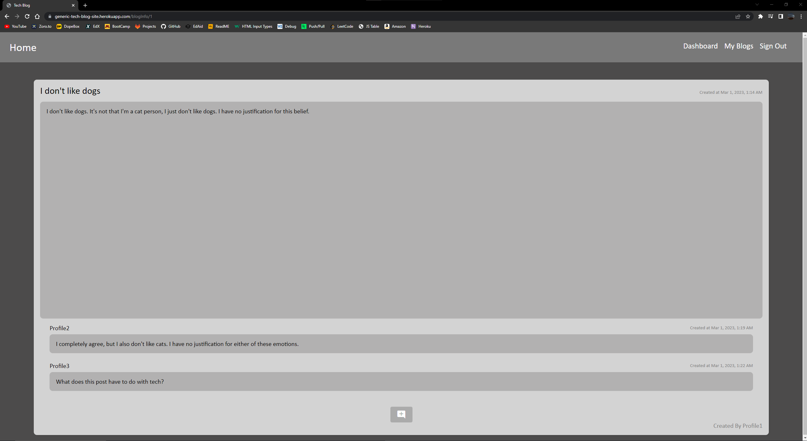
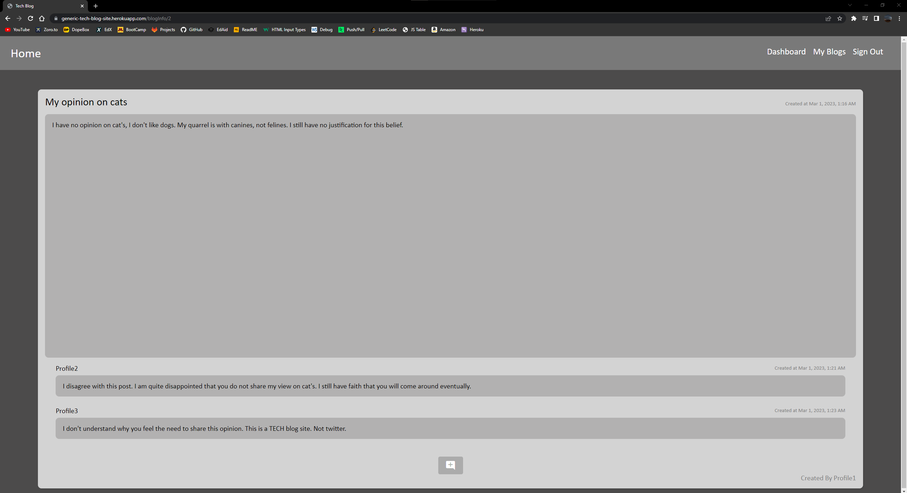

# tech-blog 

# Description

This application is a simple tech blog site using technologies like express, sql, sequelize and more.
You will first be introduced to the main page. You will not be able to access anything else until you are logged in to an account.
If you are currently not signed in, you can navigate to the "Sign In" link in the navbar.
If you already have an account, you can sign up instead.
In order to log in, or sign up, you will have to meet certain password and email criteria.
You then have the option to create a new blog post if you navigate back to the home page using the navbar.
The "Dashboard" link will redirect you to a page that will display all existing blogs if they exist.
If you click on a blog, you can view the comments it has, or leave a comment of you own.
The "My Blogs" link will redirect you to a page where you can view you existing blogs, and edit or delete them id you wish.
The "Sign Out" link will sign you out, and redirect you to the homepage.

Open the app here : https://generic-tech-blog-site.herokuapp.com

- Below are images of the app and it's various pages in use.

  

  

  

  

  

  

  

## Table of Contents

- [Installation](#installation)
- [Usage](#usage)
- [Credits](#credits)
- [License](#license)

# Installation

There are no required installations for this project.

# Usage

Open up the app and go off.

# Contributors

I am currently the lone contributor.

# License

This project uses the MIT license.

# Tests

There are currently no tests for this application so far.

# Questions

Contact me at mohamedfarah0508@gmail.com for any questions.
